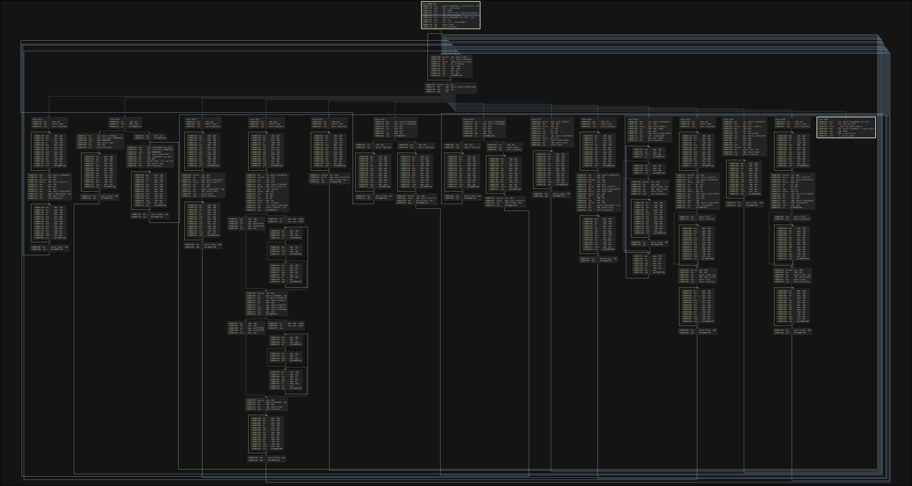

# Unknown VM by Garuda

<div align="center">
  
</div>

This directory contains all files related to the 
reverse engineering process of a crackme with a custom 
virtual machine architecture made by garuda.

```txt
scripts/ <- python scripts for deobfuscation
bin/ <- crackme 
db/ <- binary ninja & ida databases
img/ <- images
```

## Deobfuscation Script Usage:

```bash
$ ./scripts/deobfuscator.py -h
usage: deobfuscator.py [-h] [-a] [--add] [--or] [--and] filename

GarudaVM Deobfuscator

positional arguments:
  filename    file to process

options:
  -h, --help  show this help message and exit
  -a, --all   run all patches
  --add       deobfuscate the ADD operations
  --or        deobfuscate the OR operations
  --and       deobfuscate the AND operations
```

## Disassembler Usage:

```bash
$ python ./scripts/disassembler.py
Usage: scripts/disassembler.py <path_to_dump>
```

# Dumped Code:

This is useless, I just like the picture...

<div align="center">
  
</div>
